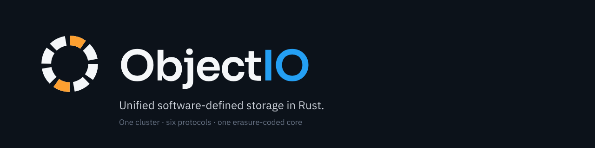

<p align="center"></p>

# ObjectIO

**Unified software-defined storage in Rust.** One cluster, one binary per
service, six protocols on a shared erasure-coded durability core:

- **S3** — wire-compatible with AWS S3 (SigV4, multipart, policies, SSE)
- **Apache Iceberg REST Catalog** — embedded; warehouse creation
  auto-provisions its backing bucket
- **Delta Lake** — native `_delta_log/` tables + uniform Delta over
  Iceberg; shares data via the Delta Sharing protocol
- **Delta Sharing** — open protocol, bearer-token auth, presigned S3
  URLs for recipients
- **Unity Catalog** — Databricks-compatible REST surface at
  `/api/2.1/unity-catalog/`; three-level governance (catalog.schema.table),
  row filters, column masks, default deny-direct-S3
- **Block** — iSCSI, NVMe-oF, NBD attachment targets with thin
  provisioning, snapshots, clones, per-volume QoS

Everything runs on top of topology-aware, failure-domain-hardened
erasure coding (Reed-Solomon, LRC) with a Raft-consensus metadata
service.

## Features

- **Wire-compatible S3** — AWS CLI, boto3, SDKs, s3cmd all just work
- **Erasure coding** — 4+2 default, configurable up to 20+4; LRC for
  large clusters; ISA-L on x86, pure-Rust elsewhere (identical wire
  format)
- **Topology-aware placement** — 5-level failure domains (region →
  zone → dc → rack → host); hard-enforced, locality-aware reads
- **Iceberg REST Catalog** — `/iceberg/v1/*`; works with Spark, Trino,
  PyIceberg, Flink; IAM-style policies at namespace + table level;
  vended credentials
- **Delta Lake** — native `_delta_log/` tables + uniform Delta over
  Iceberg; shares data via the Delta Sharing protocol
- **Delta Sharing server** — open protocol, bearer-token auth,
  presigned S3 URLs for recipients
- **Unity Catalog** — Databricks-compatible REST surface at
  `/api/2.1/unity-catalog/`; three-level governance (catalog.schema.table),
  row filters, column masks, default deny-direct-S3 on backing buckets,
  OIDC group bridging, full CRUD for catalogs/schemas/tables/volumes/models
- **Distributed block volumes** — snapshots, writable clones, thin
  provisioning, QoS (IOPS + bandwidth)
- **Pluggable grep engines** — regex (default), PCRE2, Hyperscan; prefix
  grep with pagination; stream grep across many keys
- **io_uring** — async I/O hot path on Linux via io_uring
- **Split control plane** — gateway can bind 4 separate listeners
  (data plane, admin, ops console, tenant console); audience gating
  between ops and tenant surfaces
- **Two-bundle console** — React SPA split into ops (system admin) and
  tenant (end-user) bundles; ops refuses tenant creds, tenant refuses
  admin creds
- **Slug-style BYO-OIDC** — per-tenant OIDC providers with tenant admin
  configuration
- **Raft metadata** — single-pod dev mode or 3+-pod HA; no external
  service dependency
- **Encryption at rest** — SSE-S3, SSE-C, SSE-KMS (local or external
  Vault)
- **Multi-tenancy** — per-tenant users, keys, quotas, buckets,
  warehouses, shares; OIDC SSO (Keycloak, Entra, Okta, Google)
- **Web console** — React SPA at `/_console/`; AK/SK or OIDC login;
  topology viz, tables, monitoring
- **Prometheus metrics** — per-operation histograms on S3, Iceberg,
  OSD, block paths; locality metrics split by topology distance
- **One all-in-one binary** — `objectio-aio` runs meta + OSD + gateway
  in one process for quick tests and appliance builds

## Quickstart

### Quick deploy — the `objectio-aio` single binary

The fastest way to get a working ObjectIO cluster is the all-in-one
binary: meta + OSD + gateway running in one process, console embedded,
SSE master key auto-persisted, admin AK/SK printed on first start.
Ideal for laptops, demos, smoke tests, and appliance deployments.

**Linux / macOS (auto-detects platform):**

```sh
VERSION=v0.1.0
OS=$(uname | tr '[:upper:]' '[:lower:]' | sed 's/darwin/darwin/;s/linux/linux/')
ARCH=$(uname | tr '[:upper:]' '[:lower:]' | sed 's/x86_64/amd64/;s/aarch64/arm64/;s/arm64/arm64/')
curl -L -o objectio-aio \
    "https://github.com/object-io/objectio/releases/download/${VERSION}/objectio-aio-${VERSION}-${OS}-${ARCH}"
chmod +x objectio-aio
sudo mv objectio-aio /usr/local/bin/
objectio-aio
```

Pre-built binaries ship for: `linux-amd64`, `linux-arm64`, `darwin-arm64`.

The banner prints:

```
━━━ ObjectIO ready ━━━
  S3 / Iceberg / Delta / Unity : http://localhost:9000
  Console                         : http://localhost:9000/_console/
  Admin access key                : AKIA...
  Admin secret key                : ...
  AWS_ACCESS_KEY_ID=AKIA... AWS_SECRET_ACCESS_KEY=... \
    aws --endpoint-url http://localhost:9000 s3 mb s3://test
```

Add `--data ~/objectio-data` to persist state across restarts
(otherwise a tempdir is used and wiped on exit). `Ctrl-C` exits
cleanly.

### Production — helm chart on Kubernetes

```sh
helm install objectio oci://ghcr.io/object-io/charts/objectio \
   --version 0.1.0 \
   -f your-values.yaml
```

Or for a local-dev cluster that exercises the same chart against kind:

```sh
git clone https://github.com/object-io/objectio
cd objectio && make kind-up
```

Both paths pull the universal image `ghcr.io/object-io/objectio:<tag>`
— one multi-arch image that every service container overrides the
entrypoint on (gateway / meta / osd / block-gateway / cli).

### Using it

```sh
# S3
aws --endpoint-url http://localhost:9000 s3 mb s3://my-bucket
aws --endpoint-url http://localhost:9000 s3 cp file.txt s3://my-bucket/

# Iceberg REST (PyIceberg / Spark / Trino point at)
#   http://localhost:9000/iceberg/v1
# Create a warehouse first:
curl -s -u $AK:$SK -X POST -H 'Content-Type: application/json' \
    -d '{"name":"analytics"}' \
  http://localhost:9000/_admin/warehouses

# Delta Sharing (bearer-token auth)
#   http://localhost:9000/delta-sharing/v1/

# Unity Catalog (Databricks-compatible REST)
#   http://localhost:9000/api/2.1/unity-catalog/
```

### Building from source

```sh
# macOS
brew install nasm autoconf automake libtool llvm protobuf
# Ubuntu / Debian
sudo apt-get install build-essential nasm autoconf automake libtool libclang-dev protobuf-compiler

cargo build --workspace --release --features isal    # omit --features on ARM
```


## License

This repository uses a split licensing model:

- **Apache 2.0** — everything outside `enterprise/`; fully open-source,
  free to use, modify, and distribute
- **BUSL 1.1** — `enterprise/crates/objectio-iceberg`,
    `enterprise/crates/objectio-delta-sharing`, and
    `enterprise/crates/objectio-unity-catalog`; source-available with
  an additional-use grant (you may run it internally), but you may not
  offer it as a competing paid managed service

On **2030-04-18** the BUSL-licensed files automatically convert to
Apache 2.0 under the BUSL change-license clause.

Enterprise features are also gated at runtime by an Ed25519-signed
license file; without one, those endpoints return `403
EnterpriseLicenseRequired`. Install a license through the console or
`PUT /_admin/license`.
